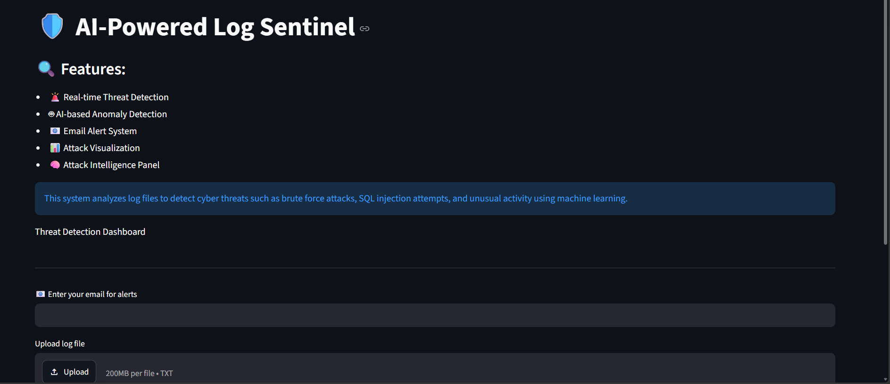
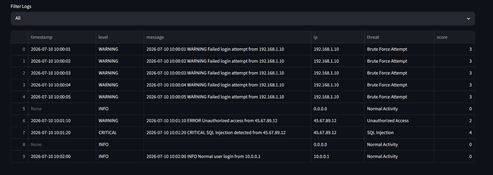
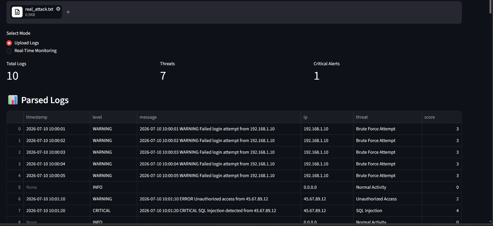
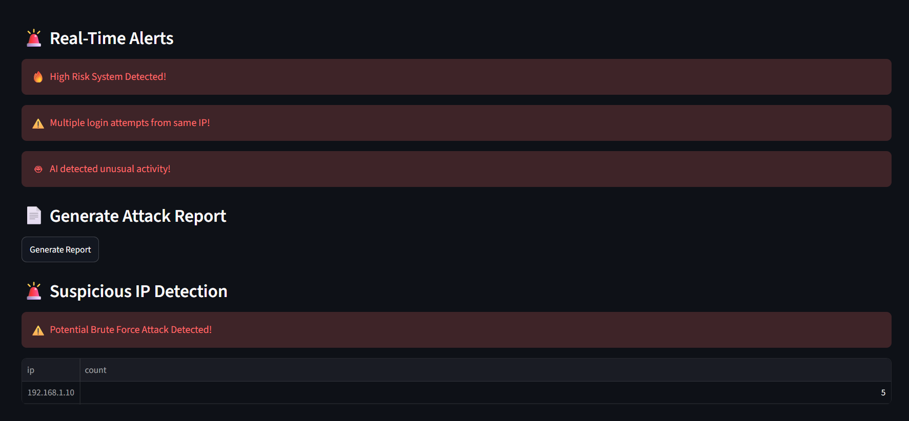
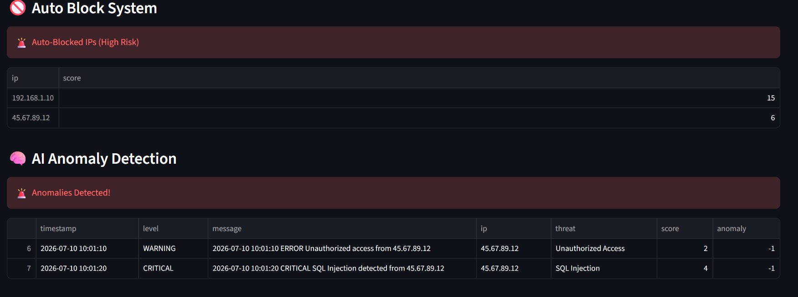
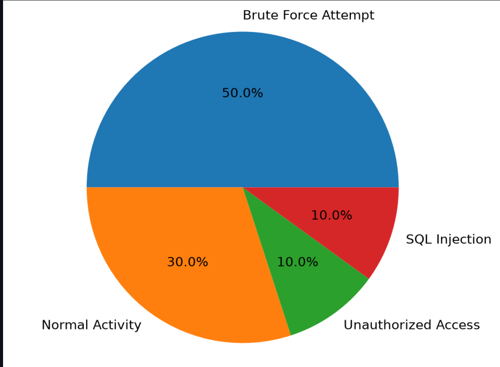
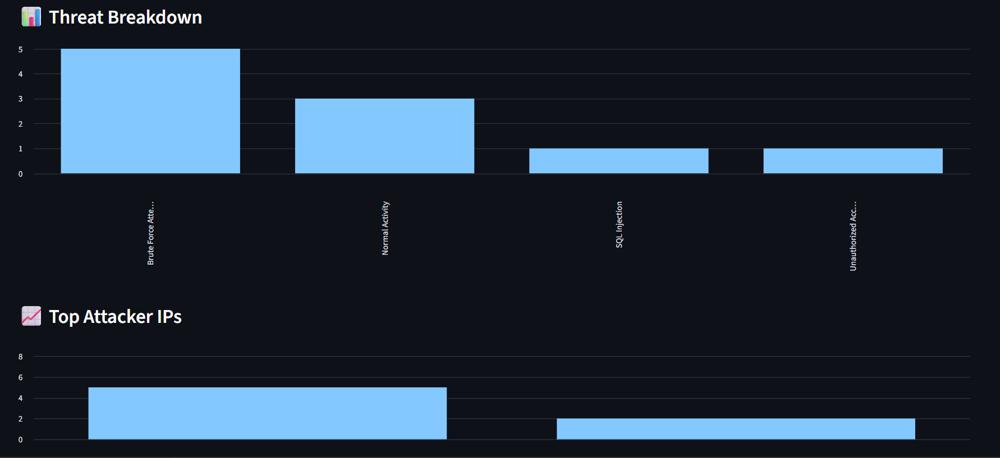
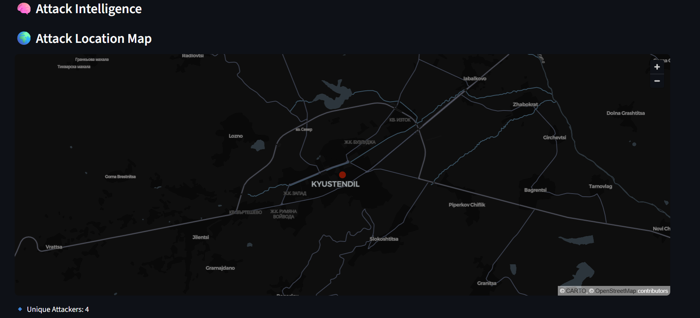
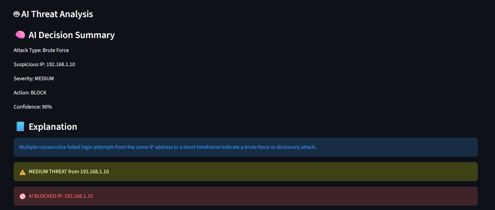

# 🛡️ AI Log Sentinel

AI-Powered Cybersecurity Threat Detection and Log Analysis Platform.

## 📌 Overview

AI Log Sentinel analyzes system logs and detects cyber threats such as:

- SQL Injection
- Brute Force Attacks
- XSS Attacks
- Unauthorized Access
- Suspicious Activities

The platform combines:

- Rule-Based Detection
- Machine Learning (Isolation Forest)
- Gemini AI Threat Analysis
- FastAPI Backend
- Streamlit Dashboard

---

## 🚀 Features

### Threat Detection
- SQL Injection Detection
- Brute Force Detection
- XSS Detection
- Unauthorized Access Detection

### AI Security Engine
- Gemini AI Analysis
- Threat Classification
- Confidence Scoring
- Attack Explanation

### Machine Learning
- Isolation Forest Anomaly Detection

### Security Response
- Auto IP Blocking
- Blacklist Generation
- Email Alerts

### Dashboard
- Threat Metrics
- Risk Score Meter
- Attack Timeline
- Top Attacker IPs
- Threat Distribution Charts
- Attack Location Map

---

## 🏗️ Architecture

```text
User
 ↓
Streamlit Dashboard
 ↓
FastAPI Backend
 ↓
AI Engine (Gemini)
 ↓
Threat Analysis
 ↓
Auto Block + Alerts + Database
```

## 🧪 Automated Tests

Project includes:

- Parser Tests
- API Tests

Current Status:

```text
8 Tests Passed
```

---

## 🛠️ Technologies Used

- Python
- Streamlit
- FastAPI
- Gemini AI
- Pandas
- Scikit-Learn
- SQLite
- Matplotlib

## 📸 Project Screenshots

### Dashboard Overview



---

### Total logs



### Parsed Log Analysis



---

### Threat Detection and Alerts




---

### Automated IP Blocking



---

### Threat Distribution



---

### Threat Breakdown and Top Attacker IPs



---

### Attack Location Map



---

### AI Threat Analysis



---

## ▶️ Run Locally

Install requirements:

```bash
pip install -r requirements.txt
```

Run API:

```bash
python -m uvicorn api_server:app --reload
```

Run Dashboard:

```bash
 python -m streamlit run app.py
```

---

## 📊 Future Improvements

- Live SIEM Integration
- Firewall Integration
- Cloud Deployment
- Multi-Agent AI Threat Hunting
- Real-Time Log Streaming

---

## 👨‍💻 Author

Nisarg Manohar

Computer Engineering | AI & Cybersecurity Enthusiast